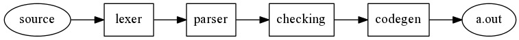
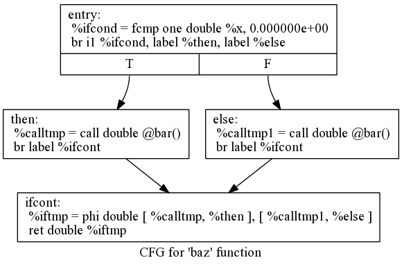
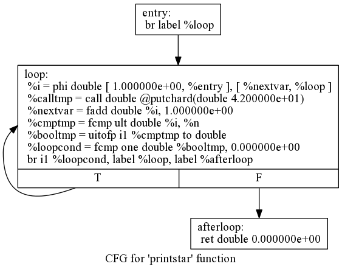
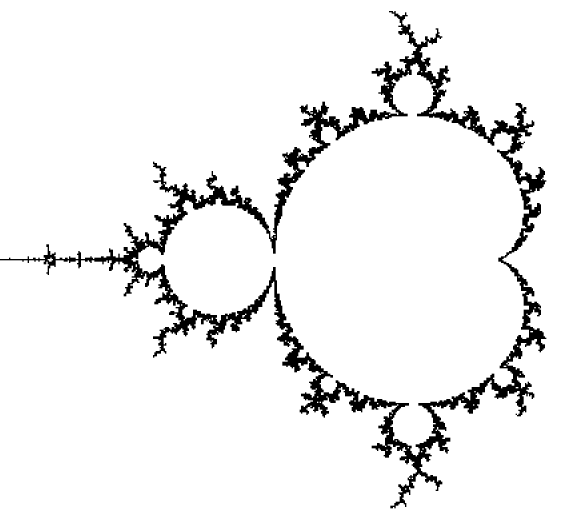
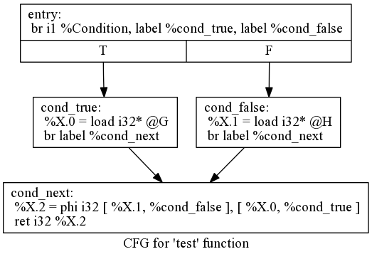

% Implementing a JIT Compiled Language with Haskell and LLVM
% Stephen Diehl
% December 25, 2013

Adapted by Stephen Diehl (
<a class="author" href="https://twitter.com/smdiehl">
@smdiehl</a> )

This is an [open source project](https://github.com/sdiehl/kaleidoscope) hosted on Github. Corrections
and feedback always welcome.

The written text licensed under the [LLVM
License](http://llvm.org/releases/2.8/LICENSE.TXT)
and is adapted from the original [LLVM
documentation](http://llvm.org/docs/tutorial/index.html).
The new Haskell source is released under the MIT license.

Chapter 1 ( Introduction )
=========

Welcome to the Haskell version of "Implementing a language with LLVM" tutorial. This tutorial runs through the
implementation of a simple language, and the basics of how to build a compiler in Haskell, showing how fun and
easy it can be. This tutorial will get you up and started as well as help to build a framework you can extend
to other languages. The code in this tutorial can also be used as a playground to hack on other LLVM specific
things. This tutorial is the Haskell port of the C++, Python and OCaml Kaleidoscope tutorials.  Although most
of the original meaning of the tutorial is preserved, most of the text has been rewritten to incorporate
Haskell.

An intermediate knowledge of Haskell is required. We will make heavy use of monads and transformers without
pause for exposition. If you are not familiar with monads, applicatives and transformers then it is best to
learn these topics before proceeding. Conversely if you are an advanced Haskeller you may notice the lack of
modern techniques which could drastically simplify our code. Instead we will shy away from advanced patterns
since the purpose is to instruct in LLVM and not Haskell programming. Whenever possible we will avoid
cleverness and just do the "stupid thing".

The overall goal of this tutorial is to progressively unveil our language, describing how it is built up over
time.  This will let us cover a fairly broad range of language design and LLVM-specific usage issues, showing
and explaining the code for it all along the way, without overwhelming you with tons of details up front.

It is useful to point out ahead of time that this tutorial is really about teaching compiler techniques and
LLVM specifically, not about teaching modern and sane software engineering principles. In practice, this means
that we'll take a number of shortcuts to simplify the exposition. If you dig in and use the code as a basis
for future projects, fixing these deficiencies shouldn't be hard.

I've tried to put this tutorial together in a way that makes chapters easy to skip over if you are already
familiar with or are uninterested in the various pieces. The structure of the tutorial is:

* **Chapter #1**: Introduction to the Kaleidoscope language, and the definition of its Lexer - This shows where we
are going and the basic functionality that we want it to do. LLVM obviously works just fine with such tools,
feel free to use one if you prefer.

* **Chapter #2**: Implementing a Parser and AST - With the lexer in place, we can talk about parsing techniques and
basic AST construction. This tutorial describes recursive descent parsing and operator precedence parsing.
Nothing in Chapters 1 or 2 is LLVM-specific, the code doesn't even link in LLVM at this point. :)

* **Chapter #3**: Code generation to LLVM IR - With the AST ready, we can show off how easy generation of LLVM IR
really is.

* **Chapter #4**: Adding JIT and Optimizer Support - Because a lot of people are interested in using LLVM as a JIT,
we'll dive right into it and show you the 3 lines it takes to add JIT support. LLVM is also useful in many
other ways, but this is one simple and "sexy" way to show off its power. :)

* **Chapter #5**: Extending the Language: Control Flow - With the language up and running, we show how to extend it
with control flow operations (if/then/else and a ‘for' loop). This gives us a chance to talk about simple SSA
construction and control flow.

* **Chapter #6**: Extending the Language: User-defined Operators - This is a silly but fun chapter that talks about
extending the language to let the user program define their own arbitrary unary and binary operators (with
assignable precedence!). This lets us build a significant piece of the "language" as library routines.

* **Chapter #7**: Extending the Language: Mutable Variables - This chapter talks about adding user-defined local
variables along with an assignment operator. The interesting part about this is how easy and trivial it is to
construct SSA form in LLVM: no, LLVM does not require your front-end to construct SSA form!

* **Chapter #8**: Conclusion and other useful LLVM tidbits - This chapter wraps up the series by talking about
potential ways to extend the language, but also includes a bunch of pointers to info about "special topics"
like adding garbage collection support, exceptions, debugging, support for "spaghetti stacks", and a bunch of
other tips and tricks.

This tutorial will be illustrated with a toy language that we'll call **Kaleidoscope** (derived from "meaning
beautiful, form, and view" or "observer of beautiful forms"). Kaleidoscope is a procedural language that
allows you to define functions, use conditionals, math, etc. Over the course of the tutorial, we'll extend
Kaleidoscope to support the if/then/else construct, a for loop, user defined operators, JIT compilation with a
simple command line interface, etc.

Setup
-----

If you do not have Haskell setup, it is recommended you that you install the [Haskell
Platform](http://www.haskell.org/platform/). This will provide you with GHC, cabal and most of the Haskell
libraries needed for building our compiler.

You will of course also need LLVM 3.3 or 3.4 (not 3.2 or earlier) installed on your system. Run the command
for your Linux distribution:

```bash
$ pacman -S llvm        # Arch Linux
$ apt-get install llvm  # Debian/Ubuntu
$ emerge llvm           # Gentoo
$ yum install llvm      # SuSE Linux
```

The included "kaleidoscope.cabal" will install the necessary Haskell bindings. It is recommended that you
work within a sandbox:

```bash
$ cabal sandbox init
$ cabal configure
$ cabal install --only-dependencies
```

The Basic Language
------------------

Because we want to keep things simple, the only datatype in Kaleidoscope is a 64-bit floating point type (aka
‘double' in C parlance). As such, all values are implicitly double precision and the language doesn't require
type declarations. This gives the language a very nice and simple syntax. For example, the following simple
example computes Fibonacci numbers:

```python
# Compute the x'th fibonacci number.
def fib(x)
  if x < 3 then
    1
  else
    fib(x-1)+fib(x-2)

# This expression will compute the 40th number.
fib(40)
```

We also allow Kaleidoscope to call into standard library functions (the LLVM JIT makes this completely
trivial). This means that we can use the ‘extern' keyword to define a function before we use it (this is
also useful for mutually recursive functions). For example:

```python
extern sin(arg);
extern cos(arg);
extern atan2(arg1 arg2);

atan2(sin(.4), cos(42))
```

A more interesting example is included in Chapter 6 where we write a little Kaleidoscope application that
displays a Mandelbrot Set at various levels of magnification.

Lets dive into the implementation of this language!

LLVM Introduction
-----------------

A typical compiler pipeline will consist of several stages. The middle phase will often consist of several
representations of the code to be generated known as *intermediate representations*.



LLVM is a statically typed intermediate representation and an associated toolchain for manipulating,
optimizing and converting this intermediate form into native code. LLVM code comes in two flavors, a binary
bitcode format (``.bc``) and assembly (``.ll``). The command line tools ``llvm-dis`` and ``1lvm-as`` can be
used to convert between the two forms. We'll mostly be working with the human readable LLVM assembly and will
just refer to it casually as *IR* and reserve the word *assembly* to mean the native assembly that is the
result of compilation.  An important note is that the [binary format](http://llvm.org/docs/BitCodeFormat.html)
for LLVM bitcode starts with the magic two byte sequence ( 0x42 0x43 ) or "BC".

An LLVM *module* consists of a sequence of toplevel mutually scoped definitions of functions, globals, type
declarations, and external declarations.

Symbols used in an LLVM module are either global or local. Global symbols begin with ``@`` and local symbols
begin with ``%``. All symbols must be defined or forward declared.

```perl
declare i32 @putchar(i32)

define i32 @add(i32 %a, i32 %b) {
  %1 = add i32 %a, %b
  ret i32 %1
}

define void @main() {
  %1 = call i32 @add(i32 0, i32 97)
  call i32 @putchar(i32 %1)
  ret void
}
```

A LLVM function consists of a sequence of *basic blocks* containing a sequence of instructions and assignment
to local values. During compilation basic blocks will roughly correspond to labels in the native assembly
output.

```perl
define double @main(double %x) {
entry:
  %0 = alloca double
  br body

body:
  store double %x, double* %0
  %1 = load double* %0
  %2 = fadd double %1, 1.000000e+00
  ret double %2
}
```

First class types in LLVM align very closely with machine types. Alignment and platform specific sizes are
detached from the type specification in the [data layout](http://llvm.org/docs/LangRef.html#data-layout) for a
module.

                   Type
----------------   --------
``i1``             A unsigned 1 bit integer
``i32``            A unsigned 32 bit integer
``i32*``           A pointer to a 32 bit integer
``i32**``          A pointer to a pointer to a 32 bit integer
``double``         A 64-bit floating point value
``float (i32)``    A function taking a ``i32`` and returning a 32-bit floating point ``float``
``<4 x i32>``      A width 4 vector of 32-bit integer values.
``{i32, double}``  A struct of a 32-bit integer and a double.
``<{i8*, i32}>``   A packed structure of a integer pointer and 32-bit integer.
``[4 x i32]``      An array of four i32 values.

While LLVM is normally generated procedurally we can also write it by hand. For example consider the following
minimal LLVM IR example.

```perl
declare i32 @putchar(i32)

define void @main() {
  call i32 @putchar(i32 42)
  ret void
}
```

This will compile (using ``llc``) into the following platform specific assembly. For example ``march=x86-64``
on a Linux system we generate output like following:

```perl
	.file	"minimal.ll"
	.text
	.globl	main
	.align	16, 0x90
	.type	main,@function
main:
	movl	$42, %edi
	jmp	putchar                 
.Ltmp0:
	.size	main, .Ltmp0-main
	.section	".note.GNU-stack","",@progbits
```

What makes LLVM so compelling is it lets us write our assembly-like IR as if we had an infinite number of CPU
registers and abstracts away the register allocation and instruction selection.  LLVM IR also has the advantage
of being mostly platform independent and retargatable, although there are some details about calling
conventions, vectors, and pointer sizes which make it not entirely independent. 

As an integral part of Clang, LLVM is very well suited for compiling C-like languages, but it is nonetheless a
very adequate toolchain for compiling both imperative and functional languages. Some notable languages using
LLVM include:

* [*Idris*](http://idris-lang.org/) - A dependently typed general purpose language 
* [*Rust*](http://www.rust-lang.org/) - A general purpose systems language
* [*Parakeet*](http://www.parakeetpython.com/) - Numeric specializer for Python
* [*Cloudera Impala*](http://blog.cloudera.com/blog/2013/02/inside-cloudera-impala-runtime-code-generation/)
  Open-source real-time query engine for Apache Hadoop
* [*Disciple*](http://disciple.ouroborus.net/) - A experimental Haskell-like language with effect typing
* *Haskell* - GHC has a LLVM compilation path that is enabled with the ``-fllvm`` flag. The library ghc-core
  can be used to view the IR compilation artificats.

Full Source
-----------

See [**src/chapter1**](https://github.com/sdiehl/kaleidoscope/tree/master/src/chapter1) for the full source from
this chapter.

***

Chapter 2 (Parser and AST)
=========

Parser Combinators
------------------

For parsing in Haskell it is quite common to use a family of libraries known as *Parser Combinators* which let
us write code to generate parsers which itself looks very similar to the BNF ( [Backus–Naur
Form](https://en.wikipedia.org/wiki/Backus%E2%80%93Naur_Form) ) of the parser grammar itself! 

Structurally a parser combinator is a collection of higher-order functions which composes with other parsing
functions as input and returns a new parser as its output. Our lexer will consist of functions which operate
directly on matching string inputs and are composed with a variety of common combinators yielding the full
parser. The *Parsec* library exposes a collection of combinators:

              Combinators   
-----------   ------------
``<|>``       The choice operator tries to parse the first argument before proceeding to the second. Can be chained sequentially to a generate a sequence of options.
``many``      Consumes an arbitrary number of patterns matching the given pattern and returns them as a list.
``many1``     Like many but requires at least one match. 
``optional``  Optionally parses a given pattern returning it's value as a Maybe.
``try``       Backtracking operator will let us parse ambiguous matching expressions and restart with a different pattern.

The Lexer
---------

Our initial language has very simple lexical syntax.

**integer**: ``1``, ``-2``, ``42``

```haskell
integer :: Parser Integer
integer = Tok.integer lexer
```

**float**: ``3.14``, ``2.71``, ``0.0``

```haskell
float :: Parser Double
float = Tok.float lexer
```

**identifier**: ``a``, ``b``, ``foo``, ``ncc1701d``


```haskell
identifier :: Parser String
identifier = Tok.identifier lexer
```

And several tokens which enclose other token(s) returning a compose expression.

```haskell
parens :: Parser a -> Parser a
parens = Tok.parens lexer

semiSep :: Parser a -> Parser [a]
semiSep = Tok.semiSep lexer

commaSep :: Parser a -> Parser [a]
commaSep = Tok.commaSep lexer
```

Lastly our lexer requires that several tokens be reserved and not used
identifiers, we reference these as separately.

**reserved**: ``def``, ``extern``

**reservedOp**: ``+``, ``*``, ``-``, ``;``

```haskell
reserved :: String -> Parser ()
reserved = Tok.reserved lexer
```

```haskell
reservedOp :: String -> Parser ()
reservedOp = Tok.reservedOp lexer
```

Putting it all together we have our ``Lexer.hs`` module.

~~~~ {.haskell include="src/chapter2/Lexer.hs"}
~~~~

The Parser
----------

The AST for a program captures its behavior in such a way that it is easy for later stages of the compiler
(e.g. code generation) to interpret. We basically want one object for each construct in the language, and the
AST should closely model the language. In Kaleidoscope, we have expressions, and a function object. When
parsing with Parsec we will unpack tokens straight into our AST which we define as the ``Expr`` algebraic data
type:

~~~~ {.haskell include="src/chapter2/Syntax.hs"}
~~~~

This is all (intentionally) rather straight-forward: variables capture the variable name, binary operators
capture their operation (e.g. `Plus`, `Minus`, ...), and calls capture a function name as well as a list of any
argument expressions.

We create Parsec parser which will scan a input source and unpack it into our ``Expr`` type. The code composes
within the ``Parser`` to generate the resulting parser which is then executed using the ``parse`` function.

~~~~ {.haskell include="src/chapter2/Parser.hs"}
~~~~

The REPL
---------

The driver for this simply invokes all of the compiler in a loop feeding the resulting artifacts to the next
iteration. We will use the [haskeline](http://hackage.haskell.org/package/haskeline) library to give us
readline interactions for the small REPL.

~~~~ {.haskell include="src/chapter2/Main.hs"}
~~~~

In under 100 lines of code, we fully defined our minimal language, including a lexer, parser, and AST builder.
With this done, the executable will validate Kaleidoscope code, print out the Haskell representation of the
AST, and tell us the position information for any syntax errors. For example, here is a sample interaction:

```bash
ready> def foo(x y) x+foo(y, 4.0);
Function "foo" [Var "x",Var "y"] (BinOp Plus (Var "x") (Call "foo" [Var "y",Float 4.0]))

ready> def foo(x y) x+y y;
Function "foo" [Var "x",Var "y"] (BinOp Plus (Var "x") (Var "y"))
Var "y"

ready> def foo(x y) x+y );
"<stdin>" (line 1, column 18):
unexpected ")"
expecting float, natural, "extern", "def", identifier, "(" or ";"

ready> extern sin(a);
Extern "sin" [Var "a"]

ready> ^D
Goodbye.
```

There is a lot of room for extension here. You can define new AST nodes, extend the language in many ways,
etc. In the next installment, we will describe how to generate LLVM Intermediate Representation (IR) from the
AST.

Full Source
-----------

See [**src/chapter2**](https://github.com/sdiehl/kaleidoscope/tree/master/src/chapter2) for the full source from
this chapter.

***

Chapter 3 ( Code Generation )
=========

This chapter illustrates how to transform the Abstract Syntax Tree, built in Chapter 2, into LLVM IR. This
will demonstrate a little bit about how LLVM does things, as well as demonstrate how easy it is to use.

Haskell LLVM Bindings
---------------------

The LLVM bindings for Haskell are split across two packages:

* **llvm-general-pure** is a pure Haskell representation of the LLVM IR.

* **llvm-general** is the FFI bindings to LLVM required for constructing the C representation of the
  LLVM IR and performing optimization and compilation.

llvm-general-pure does not require the LLVM libraries be available on the system.

On Hackage there is an older version of llvm bindings named ``llvm`` and ``llvm-base`` which should likely be
avoided since they has not been updated since it's development a few years ago.

As an aside the GHCi can have issues with the FFI and can lead to errors when working with ``llvm-general``.
If you end up with errors like the following, then you are likely trying to use ``GHCi`` or ``runhaskell`` and
it is unable to link against your LLVM library. Instead compile with standalone ``ghc``.

```bash
Loading package llvm-general-3.3.8.2 
... linking 
... ghc: /usr/lib/llvm-3.3/lib/libLLVMSupport.a: unknown symbol `_ZTVN4llvm14error_categoryE'
ghc: unable to load package `llvm-general-3.3.8.2'
````

Code Generation Setup
---------------------

We start with a new Haskell module ``Codegen.hs`` which will hold the pure code generation logic that we'll
use to drive building llvm-general's AST. For simplicity's sake  we'll insist that all
variables be of a single type, the ``double`` type. 

```haskell
double :: Type
double = FloatingPointType 64 IEEE
```

To start we create a new record type to hold the internal state of our code generator as we walk the AST.
We'll use two records, one for the toplevel module code generation and one for basic blocks inside of function
definitions.

```haskell
type SymbolTable = [(String, Operand)]

data CodegenState
  = CodegenState {
    currentBlock :: Name                     -- Name of the active block to append to
  , blocks       :: Map.Map Name BlockState  -- Blocks for function
  , symtab       :: SymbolTable              -- Function scope symbol table
  , blockCount   :: Int                      -- Count of basic blocks
  , count        :: Word                     -- Count of unnamed instructions
  , names        :: Names                    -- Name Supply
  } deriving Show

data BlockState
  = BlockState {
    idx   :: Int                            -- Block index
  , stack :: [Named Instruction]            -- Stack of instructions
  , term  :: Maybe (Named Terminator)       -- Block terminator
  } deriving Show
```

We'll hold the state of the code generator inside of ``Codegen`` State monad, the Codegen monad contains a map
of block names to their ``BlockState`` representation. 

```haskell
newtype Codegen a = Codegen { runCodegen :: State CodegenState a }
  deriving (Functor, Applicative, Monad, MonadState CodegenState )
```

At the top level we'll create a ``LLVM`` State monad which will hold all code a for the LLVM module and upon
evaluation will emit llvm-general Module containing the AST. We'll append to the list of definitions in the
``AST.Module`` field ``moduleDefinitions``.

```haskell
newtype LLVM a = LLVM { unLLVM :: State AST.Module a }
  deriving (Functor, Applicative, Monad, MonadState AST.Module )

runLLVM :: AST.Module -> LLVM a -> AST.Module
runLLVM = flip (execState . unLLVM)

emptyModule :: String -> AST.Module
emptyModule label = defaultModule { moduleName = label }

addDefn :: Definition -> LLVM ()
addDefn d = do
  defs <- gets moduleDefinitions
  modify $ \s -> s { moduleDefinitions = defs ++ [d] }
```

Inside of our module we'll need to insert our toplevel definitions. For our purposes this will consist
entirely of local functions and external function declarations.

```haskell
define ::  Type -> String -> [(Type, Name)] -> [BasicBlock] -> LLVM ()
define retty label argtys body = addDefn $
  GlobalDefinition $ functionDefaults {
    name        = Name label
  , parameters  = ([Parameter ty nm [] | (ty, nm) <- argtys], False)
  , returnType  = retty
  , basicBlocks = body
  }

external ::  Type -> String -> [(Type, Name)] -> LLVM ()
external retty label argtys = addDefn $
  GlobalDefinition $ functionDefaults {
    name        = Name label
  , parameters  = ([Parameter ty nm [] | (ty, nm) <- argtys], False)
  , returnType  = retty
  , basicBlocks = []
  }
```

Blocks
------

With our monad we'll create several functions to manipulate the current block state so that we can push and
pop the block "cursor" and append instructions into the current block.

```haskell
entry :: Codegen Name
entry = gets currentBlock

addBlock :: String -> Codegen Name
addBlock bname = do
  bls <- gets blocks
  ix  <- gets blockCount
  nms <- gets names

  let new = emptyBlock ix
      (qname, supply) = uniqueName bname nms

  modify $ \s -> s { blocks = Map.insert (Name qname) new bls
                   , blockCount = ix + 1
                   , names = supply
                   }
  return (Name qname)

setBlock :: Name -> Codegen Name
setBlock bname = do
  modify $ \s -> s { currentBlock = bname }
  return bname

getBlock :: Codegen Name
getBlock = gets currentBlock

modifyBlock :: BlockState -> Codegen ()
modifyBlock new = do
  active <- gets currentBlock
  modify $ \s -> s { blocks = Map.insert active new (blocks s) }

current :: Codegen BlockState
current = do
  c <- gets currentBlock
  blks <- gets blocks
  case Map.lookup c blks of
    Just x -> return x
    Nothing -> error $ "No such block: " ++ show c
```

Instructions
------------

Now that we have the basic infrastructure in place we'll wrap the raw llvm-general AST nodes inside a
collection of helper functions to push instructions onto the stack held within our monad.

Instructions in LLVM are either numbered sequentially (``%0``, ``%1``, ...) or given explicit variable names (``%a``,
``%foo``, ..). For example the arguments to the following function are named values, while the result of the add
instructions unnamed.

```perl
define i32 @add(i32 %a, i32 %b) {
  %1 = add i32 %a, %b
  ret i32 %1
}
```

In the implementation of llvm-general both these types are represented in a sum type containing the
constructors ``UnName`` and ``Name``. For most of our purpose we will simply use numbered expressions and map
them numbers to identifiers with in our symbol table. Every instruction added will increment the internal
counter, to accomplish we add a fresh name supply.

```haskell
fresh :: Codegen Word
fresh = do
  i <- gets count
  modify $ \s -> s { count = 1 + i }
  return $ i + 1
```

Throughout our code we will however refer named values within the module, these have a special data type
``Name`` for which we'll create a second name supply map which guarantees that our block names are unique.
We'll also instantiate a ``IsString`` instance for this type so that Haskell can automatically perform the
boilerplate coercions between String types.

```haskell
type Names = Map.Map String Int

uniqueName :: String -> Names -> (String, Names)
uniqueName nm ns =
  case Map.lookup nm ns of
    Nothing -> (nm,  Map.insert nm 1 ns)
    Just ix -> (nm ++ show ix, Map.insert nm (ix+1) ns)

instance IsString Name where
  fromString = Name . fromString
```

Since we can now work with named LLVM values we need to create several functions for referring to 
references of values.

```haskell
local ::  Name -> Operand
local = LocalReference

externf :: Name -> Operand
externf = ConstantOperand . C.GlobalReference
```

Our function ``externf`` will emit a named value which refers to a toplevel function (``@add``) in our module
or  will refer to an externally declared function (``@putchar``). For instance:

```perl
declare i32 @putchar(i32)

define i32 @add(i32 %a, i32 %b) {
  %1 = add i32 %a, %b
  ret i32 %1
}

define void @main() {
  %1 = call i32 @add(i32 0, i32 97)
  call i32 @putchar(i32 %1)
  ret void
}
```

Since we'd like to refer to values on the stack by named quantities we'll implement a simple symbol table as
an association list letting us assign variable names to operand quantities and subsequently look them up when
used.

```haskell
assign :: String -> Operand -> Codegen ()
assign var x = do
  lcls <- gets symtab
  modify $ \s -> s { symtab = [(var, x)] ++ lcls }

getvar :: String -> Codegen Operand
getvar var = do
  syms <- gets symtab
  case lookup var syms of
    Just x  -> return x
    Nothing -> error $ "Local variable not in scope: " ++ show var
```

Now that we have a way of naming instructions we'll create a internal function to take a llvm -general AST
node and push it on the current basic block stack. We'll return the left hand side reference of the
instruction. Instructions will come in two flavors, *instructions* and *terminators*. Every basic block has a
unique terminator and every last basic block in a function must terminate in a ``ret``.

```haskell
instr :: Instruction -> Codegen Operand
instr ins = do
  n   <- fresh
  blk <- current
  let i = stack blk
  let ref = (UnName n)
  modifyBlock $ blk { stack = i ++ [ref := ins] }
  return $ local ref

terminator :: Named Terminator -> Codegen (Named Terminator)
terminator trm = do
  blk <- current
  modifyBlock $ blk { term = Just trm }
  return trm
```

Using the ``instr`` function we now wrap the AST nodes for basic arithmetic operations of floating point
values.

```haskell
fadd :: Operand -> Operand -> Codegen Operand
fadd a b = instr $ FAdd a b []

fsub :: Operand -> Operand -> Codegen Operand
fsub a b = instr $ FSub a b []

fmul :: Operand -> Operand -> Codegen Operand
fmul a b = instr $ FMul a b []

fdiv :: Operand -> Operand -> Codegen Operand
fdiv a b = instr $ FDiv a b []
```

On top of the basic arithmetic functions we'll add the basic control flow operations which will allow us to
direct the control flow between basic blocks and return values.

```haskell
br :: Name -> Codegen (Named Terminator)
br val = terminator $ Do $ Br val []

cbr :: Operand -> Name -> Name -> Codegen (Named Terminator)
cbr cond tr fl = terminator $ Do $ CondBr cond tr fl []

ret :: Operand -> Codegen (Named Terminator)
ret val = terminator $ Do $ Ret (Just val) []
```

Finally we'll add several "effect" instructions which will invoke memory and evaluation side-effects. The
``call`` instruction will simply take a named function reference and a list of arguments and evaluate it and
simply invoke it at the current position. The ``alloca`` instruction will create a pointer to a stack
allocated uninitialized value of the given type.

```haskell
call :: Operand -> [Operand] -> Codegen Operand
call fn args = instr $ Call False CC.C [] (Right fn) (toArgs args) [] []

alloca :: Type -> Codegen Operand
alloca ty = instr $ Alloca ty Nothing 0 []

store :: Operand -> Operand -> Codegen Operand
store ptr val = instr $ Store False ptr val Nothing 0 []

load :: Operand -> Codegen Operand
load ptr = instr $ Load False ptr Nothing 0 []
```

From AST to IR
--------------

Now that we have the infrastructure in place we can begin ingest our AST from ``Syntax.hs`` and construct a
LLVM module from it. We will create a new ``Emit.hs`` module and spread the logic across two functions. The
first ``codegenTop`` will emit toplevel constructions in modules ( functions and external definitions ) and
will return a ``LLVM`` monad. The last instruction on the stack we'll bind into the ``ret`` instruction to
ensure and emit as the return value of the function. We'll also sequentially ``assign`` each of the named
arguments from the function to a stack allocated value with a reference in our symbol table.

```haskell
codegenTop :: S.Expr -> LLVM ()
codegenTop (S.Function name args body) = do
  define double name fnargs bls
  where
    fnargs = toSig args
    bls = createBlocks $ execCodegen $ do
      entry <- addBlock entryBlockName
      setBlock entry
      forM args $ \a -> do
        var <- alloca double
        store var (local (AST.Name a))
        assign a var
      cgen body >>= ret

codegenTop (S.Extern name args) = do
  external double name fnargs []
  where fnargs = toSig args

codegenTop exp = do
  define double "main" [] blks
  where
    blks = createBlocks $ execCodegen $ do
      entry <- addBlock entryBlockName
      setBlock entry
      cgen exp >>= ret

toSig :: [String] -> [(AST.Type, AST.Name)]
toSig = map (\x -> (double, AST.Name x))
```

The second is the expression level code generation (``cgen``) which will recursively walk the AST pushing
instructions on the stack and changing the current block as needed. The simplest AST node is constant integers
and floating point values which simply return constant values in LLVM IR.

```haskell
cgen :: S.Expr -> Codegen AST.Operand
cgen (S.Float n) = return $ cons $ C.Float (F.Double n)
```

We need to reference local variables so we'll invoke our ``getvar`` function in conjunction with a ``load``
use values. The conscious reader will intuit that this might result in an excessive amount of extraneous
instructions pushing temporary values on the stack, something that we'll address later with a simple
optimization pass.


```haskell
cgen (S.Var x) = getvar x >>= load
```

For ``Call`` we'll first evaluate each argument and then invoke the function with the values. Since our
language only has double type values, this is trivial and we don't need to worry too much.

```haskell
cgen (S.Call fn args) = do
  largs <- mapM cgen args
  call (externf (AST.Name fn)) largs
```

Finally for our operators we'll construct a predefined association map of symbol strings to implementations of
functions with the corresponding logic for the operation. 

```haskell
binops = Map.fromList [
      ("+", fadd)
    , ("-", fsub)
    , ("*", fmul)
    , ("/", fdiv)
    , ("<", lt)
  ]
```

For the comparison operator we'll invoke the ``uitofp`` which will convert a unsigned integer quantity to a
floating point value. LLVM requires the unsigned single bit types as the values for comparison and test
operations but we prefer to work entirely with doubles where possible.

```haskell
lt :: AST.Operand -> AST.Operand -> Codegen AST.Operand
lt a b = do
  test <- fcmp FP.ULT a b
  uitofp double test
```

Just like the ``call`` instruction above we simply generate the code for operands and invoke the function we
just looked up for the symbol.

```haskell
cgen (S.BinaryOp op a b) = do
  case Map.lookup op binops of
    Just f -> do
      ca <- cgen a
      cb <- cgen b
      f ca cb
    Nothing -> error "No such operator"
```

Putting everything together we find that we nice little minimal language that supports both function
abstraction and basic arithmetic. The final step is to hook into LLVM bindings to generate a string
representation of the LLVM IR which we'll print our the string on each action in the REPL. We'll
discuss these functions in more depth in the next chapter.

```haskell
codegen :: AST.Module -> [S.Expr] -> IO AST.Module
codegen mod fns = withContext $ \context ->
  liftError $ withModuleFromAST context newast $ \m -> do
    llstr <- moduleString m
    putStrLn llstr
    return newast
  where
    modn = mapM codegenTop fns
    newast = runLLVM mod modn
```

Running ``Main.hs`` we can observe our code generator in action.

```perl
ready> def foo(a b) a*a + 2*a*b + b*b
; ModuleID = 'my cool jit'

define double @foo(double %a, double %b)  {
entry:
  %0 = fmul double %a, %a
  %1 = fmul double %a, 2.000000e+00
  %2 = fmul double %1, %b
  %3 = fadd double %0, %2
  %4 = fmul double %b, %b
  %5 = fadd double %4, %3
  ret double %5
}

ready> def bar(a) foo(a, 4.0) + bar(31337)
define double @bar(double %a) {
entry:
  %0 = alloca double
  store double %a, double* %0
  %1 = load double* %0
  %2 = call double @foo(double %1, double 4.000000e+00)
  %3 = call double @bar(double 3.133700e+04)
  %4 = fadd double %2, %3
  ret double %4
}
```

Full Source
-----------

See [**src/chapter3**](https://github.com/sdiehl/kaleidoscope/tree/master/src/chapter3) for the full source from
this chapter.

***

Chapter 4 ( JIT and Optimizer Support )
=========

In the previous chapter we were able to map our language Syntax into the LLVM IR and print it out to the
screen. This chapter describes two new techniques: adding optimizer support to our language, and adding JIT
compiler support. These additions will demonstrate how to get nice, efficient code for the Kaleidoscope
language.

ASTs and Modules
----------------

We'll refer to a Module as holding the internal representation of the LLVM IR. Modules can be generated from
the Haskell LLVM AST or from strings containing bitcode.

Both data types have the same name ( Module ), so as convention we will call qualify the imports of the
libraries to distinguish between the two.

* ``AST.Module`` : Haskell AST Module
* ``Module`` : Internal LLVM Module

llvm-general provides two important functions for converting between them. ``withModuleFromAST`` has type
``ErrorT`` since it may fail if given a malformed expression, it is important to handle both cases of the
resulting Either value.

```haskell
withModuleFromAST :: Context -> AST.Module -> (Module -> IO a) -> ErrorT String IO a
moduleAST :: Module -> IO AST.Module
```

We can also generate the assembly code for our given module by passing a specification of the CPU and platform
information we wish to target, called the ``TargetMachine``.

```haskell
moduleAssembly :: TargetMachine -> Module -> ErrorT String IO String
```

Recall the so called "Bracket" pattern in Haskell for managing IO resources. llvm-general makes heavy use this
pattern to manage the life-cycle of certain LLVM resources. It is very important to remember not to pass
or attempt to use resources outside of the bracket as this will lead to undefined behavior and/or segfaults.

```haskell
bracket :: IO a        -- computation to run first ("acquire resource")
        -> (a -> IO b) -- computation to run last ("release resource")
        -> (a -> IO c) -- computation to run in-between
        -> IO c
```

In addition to this we'll often be dealing with operations which can fail in an ``EitherT`` monad if given bad
code. We'll often want to lift this error up the monad transformer stack with the pattern:

```haskell
liftError :: ErrorT String IO a -> IO a
liftError = runErrorT >=> either fail return
```

To start we'll create a ``runJIT`` function which will start with a stack of brackets. We'll then simply
generate the IR and print it out to the screen.

```haskell
runJIT :: AST.Module -> IO (Either String ())
runJIT mod = do
  withContext $ \context ->
    runErrorT $ withModuleFromAST context mod $ \m ->
      s <- moduleString m
      putStrLn s
```

Constant Folding
-----------------

Our demonstration for Chapter 3 is elegant and easy to extend. Unfortunately, it does not produce wonderful
code. However the naive construction of the LLVM module will perform some minimal transformations to generate
a module which not a literal transcription of the AST but preserves the same semantics.

The "dumb" transcription would look like:

```python
ready> def test(x) 1+2+x
define double @test(double %x) {
entry:
  %addtmp = fadd double 2.000000e+00, 1.000000e+00
  %addtmp1 = fadd double %addtmp, %x
  ret double %addtmp1
}
```

The "smarter" transcription would eliminate the first line since it contains a simple constant that can be
computed at compile-time.

```python
ready> def test(x) 1+2+x
define double @test(double %x) {
entry:
  %addtmp = fadd double 3.000000e+00, %x
  ret double %addtmp
}
```

Constant folding, as seen above, in particular, is a very common and very important optimization: so much so
that many language implementors implement constant folding support in their AST representation. This technique
is limited by the fact that it does all of its analysis inline with the code as it is built. If you take a
slightly more complex example:

```python
ready> def test(x) (1+2+x)*(x+(1+2))
define double @test(double %x) {
entry:
  %addtmp = fadd double 3.000000e+00, %x
  %addtmp1 = fadd double %x, 3.000000e+00
  %multmp = fmul double %addtmp, %addtmp1
  ret double %multmp
}
```

In this case, the left and right hand sides of the multiplication are the same value. We'd really like to see
this generate ``tmp = x+3; result = tmp*tmp`` instead of computing ``x+3`` twice.

Unfortunately, no amount of local analysis will be able to detect and correct this. This requires two
transformations: reassociation of expressions (to make the ``add``s lexically identical) and Common
Subexpression Elimination (CSE) to delete the redundant add instruction. Fortunately, LLVM provides a broad
range of optimizations that we can use, in the form of “passes”.

Optimization Passes
-------------------

LLVM provides many optimization passes, which do many different sorts of things and have different trade-offs.
Unlike other systems, LLVM doesn't hold to the mistaken notion that one set of optimizations is right for all
languages and for all situations. LLVM allows a compiler implementor to make complete decisions about what
optimizations to use, in which order, and in what situation.

As a concrete example, LLVM supports both “whole module” passes, which look across as large of body of code as
they can (often a whole file, but if run at link time, this can be a substantial portion of the whole
program). It also supports and includes “per-function” passes which just operate on a single function at a
time, without looking at other functions. For more information on passes and how they are run, see the [How to
Write a Pass](http://llvm.org/docs/WritingAnLLVMPass.html) document and the [List of LLVM
Passes](http://llvm.org/docs/Passes.html).

For Kaleidoscope, we are currently generating functions on the fly, one at a time, as the user types them in.
We aren't shooting for the ultimate optimization experience in this setting, but we also want to catch the
easy and quick stuff where possible.

We won't delve too much into the details of the passes since they are better described elsewhere. We will
instead just invoke the default "curated passes" with an optimization level which will perform most of the
common clean-ups and a few non-trivial optimizations.

```haskell
passes :: PassSetSpec
passes = defaultCuratedPassSetSpec { optLevel = Just 3 }
```

To apply the passes we create a bracket for a PassManager and invoke ``runPassManager`` on our working module.
Note that this modifies the module in-place.

```haskell
runJIT :: AST.Module -> IO (Either String AST.Module)
runJIT mod = do
  withContext $ \context ->
    runErrorT $ withModuleFromAST context mod $ \m ->
      withPassManager passes $ \pm -> do
        runPassManager pm m
        optmod <- moduleAST m
        s <- moduleString m
        putStrLn s
        return optmod
```

With this in place, we can try our test above again:

```python
ready> def test(x) (1+2+x)*(x+(1+2))
; ModuleID = 'my cool jit'

; Function Attrs: nounwind readnone
define double @test(double %x) #0 {
entry:
  %0 = fadd double %x, 3.000000e+00
  %1 = fmul double %0, %0
  ret double %1
}

attributes #0 = { nounwind readnone }
```

As expected, we now get our nicely optimized code, saving a floating point add instruction from every
execution of this function. We also see some extra metadata attached to our function, which we can ignore for
now, but is indicating certain properties of the function that aid in later optimization.

LLVM provides a wide variety of optimizations that can be used in certain circumstances. Some documentation
about the various passes is available, but it isn't very complete. Another good source of ideas can come from
looking at the passes that Clang runs to get started. The “opt” tool allows us to experiment with passes from
the command line, so we can see if they do anything.

One important optimization pass is a "analysis pass" which will validate that the internal IR is well-formed.
Since it quite possible (even easy!) to construct nonsensical or unsafe IR it is very good practice to
validate our IR before attempting to optimize or execute it. To do we simply invoke the verify function with
our active module.

```haskell

runJIT :: AST.Module -> IO (Either String AST.Module)
runJIT mod = do
  ...

  withPassManager passes $ \pm -> do
    runErrorT $ verify m

```

Now that we have reasonable code coming out of our front-end, lets talk about executing it!

Adding a JIT Compiler
---------------------

Code that is available in LLVM IR can have a wide variety of tools applied to it. For example, we can run
optimizations on it (as we did above), we can dump it out in textual or binary forms, we can compile the
code to an assembly file (.s) for some target, or we can JIT compile it. The nice thing about the LLVM IR
representation is that it is the “common currency” between many different parts of the compiler.

In this section, we'll add JIT compiler support to our interpreter. The basic idea that we want for
Kaleidoscope is to have the user enter function bodies as they do now, but immediately evaluate the top-level
expressions they type in. For example, if they type in “1 + 2;”, we should evaluate and print out 3. If they
define a function, they should be able to call it from the command line.

In order to do this, we add another function to bracket the creation of the JIT *Execution Engine*. There are
two provided engines: jit and mcjit. The distinction is not important for us but we will opt to use the newer
mcjit.

```haskell
import qualified LLVM.General.ExecutionEngine as EE

jit :: Context -> (EE.MCJIT -> IO a) -> IO a
jit c = EE.withMCJIT c optlevel model ptrelim fastins
  where
    optlevel = Just 2  -- optimization level
    model    = Nothing -- code model ( Default )
    ptrelim  = Nothing -- frame pointer elimination
    fastins  = Nothing -- fast instruction selection
```

The result of the JIT compiling our function will be a C function pointer which we can call from within the
JIT's process space. We need some (unsafe!) plumbing to coerce our foreign C function into a callable object
from Haskell. Some care must be taken when performing these operations since we're telling Haskell to "trust
us" that the pointer we hand it is actually typed as we describe it. If we don't take care with the casts we
can expect undefined behavior.

```haskell
foreign import ccall "dynamic" haskFun :: FunPtr (IO Double) -> (IO Double)

run :: FunPtr a -> IO Double
run fn = haskFun (castFunPtr fn :: FunPtr (IO Double))
```

Integrating this with our function from above we can now manifest our IR as executable code inside the
``ExecutionEngine`` and pass the resulting native types to and from the Haskell runtime.

```haskell
runJIT :: AST.Module -> IO (Either String ())
runJIT mod = do
    ...
    jit context $ \executionEngine ->
        ...
        EE.withModuleInEngine executionEngine m $ \ee -> do
          mainfn <- EE.getFunction ee (AST.Name "main")
          case mainfn of
            Just fn -> do
              res <- run fn
              putStrLn $ "Evaluated to: " ++ show res
            Nothing -> return ()
```

Having to statically declare our function pointer type is rather inflexible, if we wish to extend to this to
be more flexible a library like *libffi* is very useful for calling functions with argument types that can
be determined at runtime.

External Functions
------------------

The JIT provides a number of other more advanced interfaces for things like freeing allocated machine code,
rejit'ing functions to update them, etc. However, even with this simple code, we get some surprisingly
powerful capabilities - check this out:

```bash
ready> extern sin(x)
; ModuleID = 'my cool jit'

declare double @sin(double)

ready> extern cos(x)
; ModuleID = 'my cool jit'

declare double @sin(double)

declare double @cos(double)

ready> sin(1.0)
; ModuleID = 'my cool jit'

declare double @sin(double)

declare double @cos(double)

define double @main() {
entry:
  %0 = call double @sin(double 1.000000e+00)
  ret double %0
}

Evaluated to: 0.8414709848078965
```

Whoa, how does the JIT know about sin and cos? The answer is surprisingly simple: in this example, the JIT
started execution of a function and got to a function call. It realized that the function was not yet JIT
compiled and invoked the standard set of routines to resolve the function. In this case, there is no body
defined for the function, so the JIT ended up calling ``dlsym("sin")`` on the Kaleidoscope process itself.
Since "sin" is defined within the JIT's address space, it simply patches up calls in the module to call the
libm version of sin directly.

The LLVM JIT provides a number of interfaces for controlling how unknown functions get resolved. It allows us
to establish explicit mappings between IR objects and addresses (useful for LLVM global variables that we
want to map to static tables, for example), allows us to dynamically decide on the fly based on the function
name, and even allows us JIT compile functions lazily the first time they're called.

One interesting application of this is that we can now extend the
language by writing arbitrary C code to implement operations. For
example, if create a shared library ``cbits.so``:

~~~~ {.cpp include="src/chapter4/cbits.c"}
~~~~

Compile this with your favorite C compiler. We can then link this into our Haskell binary by simply including
it along side the rest of the Haskell source files

```bash
$ ghc cbits.so --make Main.hs -o Main
```

Now we can produce simple output to the console by using things like: ``extern putchard(x); putchard(120);``,
which prints a lowercase 'x' on the console (120 is the ASCII code for 'x'). Similar code could be used to
implement file I/O, console input, and many other capabilities in Kaleidoscope.

To bring external shared objects into the process address space we can call Haskell's bindings to the system
dynamic linking loader to load external libraries. In addition if we are statically compiling our interpreter
we can tell GHC to link against the shared objects explicitly by passing them in with the ``-l`` flag.

This completes the JIT and optimizer chapter of the Kaleidoscope tutorial. At this point, we can compile a
non-Turing-complete programming language, optimize and JIT compile it in a user-driven way.  Next up we'll
look into extending the language with control flow constructs, tackling some interesting LLVM IR issues along
the way.

Full Source
-----------

See [**src/chapter4**](https://github.com/sdiehl/kaleidoscope/tree/master/src/chapter4) for the full source from
this chapter.

***

Chapter 5 ( Control Flow )
=========

Welcome to Chapter 5 of the Implementing a language with LLVM tutorial. Parts 1-4 described the implementation
of the simple Kaleidoscope language and included support for generating LLVM IR, followed by optimizations and
a JIT compiler. Unfortunately, as presented, Kaleidoscope is mostly useless: it has no control flow other than
call and return. This means that we can't have conditional branches in the code, significantly limiting its
power. In this episode of "build that compiler", we'll extend Kaleidoscope to have an if/then/else expression
plus a simple 'for' loop.

‘if' Expressions
----------------

Extending Kaleidoscope to support if/then/else is quite straightforward. It basically requires adding lexer
support for this "new" concept to the lexer, parser, AST, and LLVM code emitter. This example is nice, because
it shows how easy it is to "grow" a language over time, incrementally extending it as new ideas are
discovered.

Before we get going on "how" we add this extension, lets talk about "what" we want. The basic idea is that we
want to be able to write this sort of thing:

```python
def fib(x)
   if x < 3 then
      1
   else
      fib(x-1) + fib(x-2)
```

In Kaleidoscope, every construct is an expression: there are no statements. As such, the if/then/else
expression needs to return a value like any other. Since we're using a mostly functional form, we'll have it
evaluate its conditional, then return the ‘then' or ‘else' value based on how the condition was resolved. This
is very similar to the C "?:" expression.

The semantics of the if/then/else expression is that it evaluates the condition to a boolean equality value:
``0.0`` is considered to be false and everything else is considered to be true. If the condition is true, the
first subexpression is evaluated and returned, if the condition is false, the second subexpression is
evaluated and returned. Since Kaleidoscope allows side-effects, this behavior is important to nail down.

Now that we know what we "want", let's break this down into its constituent pieces.


To represent the new expression we add a new AST node for it:

```haskell
data Expr
  ...
  | If Expr Expr Expr
  deriving (Eq, Ord, Show)
```

We also extend our lexer definition with the new reserved names.

```haskell
lexer :: Tok.TokenParser ()
lexer = Tok.makeTokenParser style
  where
    ops = ["+","*","-","/",";",",","<"]
    names = ["def","extern","if","then","else]
    style = emptyDef {
               Tok.commentLine = "#"
             , Tok.reservedOpNames = ops
             , Tok.reservedNames = names
             }
```

Now that we have the relevant tokens coming from the lexer and we have the AST node to build, our parsing
logic is relatively straightforward.  First we define a new parsing function:

```haskell
ifthen :: Parser Expr
ifthen = do
  reserved "if"
  cond <- expr
  reserved "then"
  tr <- expr
  reserved "else"
  fl <- expr
  return $ If cond tr fl
```

Now that we have it parsing and building the AST, the final piece is adding LLVM code generation support. This
is the most interesting part of the if/then/else example, because this is where it starts to introduce new
concepts. All of the code above has been thoroughly
described in previous chapters.

To motivate the code we want to produce, lets take a look at a simple example. Consider:

```python
extern foo();
extern bar();
def baz(x) if x then foo() else bar();
```

```perl
declare double @foo()

declare double @bar()

define double @baz(double %x) {
entry:
  %ifcond = fcmp one double %x, 0.000000e+00
  br i1 %ifcond, label %then, label %else

then:       ; preds = %entry
  %calltmp = call double @foo()
  br label %ifcont

else:       ; preds = %entry
  %calltmp1 = call double @bar()
  br label %ifcont

ifcont:     ; preds = %else, %then
  %iftmp = phi double [ %calltmp, %then ], [ %calltmp1, %else ]
  ret double %iftmp
}
```

To visualize the control flow graph, we can use a nifty feature of the LLVM opt tool. If we put this LLVM IR
into "t.ll" and run 

```bash
$ llvm-as < t.ll | opt -analyze -view-cfg
```

A window will pop up and we'll see this graph:



LLVM has many nice features for visualizing various graphs, but note that these are available only if your
LLVM was built with Graphviz support (accomplished by having Graphviz and Ghostview installed when building
LLVM).

Getting back to the generated code, it is fairly simple: the entry block evaluates the conditional expression
("x" in our case here) and compares the result to 0.0 with the ``fcmp`` one instruction (``one`` is "Ordered
and Not Equal"). Based on the result of this expression, the code jumps to either the "then" or "else" blocks,
which contain the expressions for the true/false cases.

Once the then/else blocks are finished executing, they both branch back to the ``if.exit`` block to execute the
code that happens after the if/then/else. In this case the only thing left to do is to return to the caller of
the function. The question then becomes: how does the code know which expression to return?

The answer to this question involves an important SSA operation: the Phi operation. If you're not familiar
with SSA, the [Wikipedia article](https://en.wikipedia.org/wiki/Static_single_assignment_form) is a good
introduction and there are various other introductions to it available on your favorite search engine.  The
short version is that "execution" of the Phi operation requires "remembering" which block control came from.
The Phi operation takes on the value corresponding to the input control block. In this case, if control comes
in from the ``if.then`` block, it gets the value of ``calltmp``. If control comes from the ``if.else`` block,
it gets the value of ``calltmp1``.

At this point, you are probably starting to think "Oh no! This means my simple and elegant front-end will have
to start generating SSA form in order to use LLVM!". Fortunately, this is not the case, and we strongly advise
not implementing an SSA construction algorithm in your front-end unless there is an amazingly good reason to
do so. In practice, there are two sorts of values that float around in code written for your average
imperative programming language that might need Phi nodes:

* Code that involves user variables: x = 1; x = x + 1;
* Values that are implicit in the structure of your AST, such as the Phi node in this case.

In Chapter 7 of this tutorial ("mutable variables"), we'll talk about #1 in depth. For now, just believe
and accept that you don't need SSA construction to handle this case. For #2, you have the choice of using the
techniques that we will describe for #1, or you can insert Phi nodes directly, if convenient. In this case, it
is really really easy to generate the Phi node, so we choose to do it directly.

Okay, enough of the motivation and overview, lets generate code!

In order to generate code for this, we implement the Codegen method for ``If`` node:

```haskell
cgen (S.If cond tr fl) = do
  ifthen <- addBlock "if.then"
  ifelse <- addBlock "if.else"
  ifexit <- addBlock "if.exit"

  -- %entry
  ------------------
  cond <- cgen cond
  test <- fcmp FP.ONE false cond
  cbr test ifthen ifelse -- Branch based on the condition

  -- if.then
  ------------------
  setBlock ifthen
  trval <- cgen tr       -- Generate code for the true branch
  br ifexit              -- Branch to the merge block
  ifthen <- getBlock

  -- if.else
  ------------------
  setBlock ifelse
  flval <- cgen fl       -- Generate code for the false branch
  br ifexit              -- Branch to the merge block
  ifelse <- getBlock

  -- if.exit
  ------------------
  setBlock ifexit
  phi double [(trval, ifthen), (flval, ifelse)]
```

We start by creating three blocks.


```haskell
  ifthen <- addBlock "if.then"
  ifelse <- addBlock "if.else"
  ifexit <- addBlock "if.exit"
```

Next emit the expression for the condition, then compare that value to zero to get a truth value as a 1-bit
(i.e. bool) value. We end this entry block by emitting the conditional branch that chooses between them the
two cases.

```haskell
  test <- fcmp FP.ONE false cond
  cbr test ifthen ifelse -- Branch based on the condition
```

After the conditional branch is inserted, we move switch blocks to start inserting into the ``if.then`` block.

```haskell
  setBlock ifthen
```

We recursively codegen the ``tr`` expression from the AST. To finish off the ``if.then`` block, we create an
unconditional branch to the merge block. One interesting (and very important) aspect of the LLVM IR is that it
requires all basic blocks to be "terminated" with a control flow instruction such as return or branch. This
means that all control flow, including fallthroughs must be made explicit in the LLVM IR. If we violate this
rule, the verifier will emit an error.

```haskell
  trval <- cgen tr       -- Generate code for the true branch
  br ifexit              -- Branch to the merge block
  ifthen <- getBlock     -- Get the current block
```

The final line here is quite subtle, but is very important. The basic issue is that when we create the Phi
node in the merge block, we need to set up the block/value pairs that indicate how the Phi will work.
Importantly, the Phi node expects to have an entry for each predecessor of the block in the CFG. Why then, are
we getting the current block when we just set it block 3 lines above? The problem is that the``ifthen``
expression may actually itself change the block that the Builder is emitting into if, for example, it contains
a nested "if/then/else" expression. Because calling ``cgen`` recursively could arbitrarily change the notion of
the current block, we are required to get an up-to-date value for code that will set up the Phi node.

```haskell
  setBlock ifelse
  flval <- cgen fl       -- Generate code for the false branch
  br ifexit              -- Branch to the merge block
  ifelse <- getBlock
```

Code generation for the ``if.else`` block is basically identical to codegen for the ``if.then`` block.

```haskell
  setBlock ifexit
  phi double [(trval, ifthen), (flval, ifelse)]
```

The first line changes the insertion point so that newly created code will go into the ``if.exit`` block. Once
that is done, we need to create the Phi node and set up the block/value pairs for the Phi.

Finally, the ``cgen`` function returns the phi node as the value computed by the if/then/else expression. In
our example above, this returned value will feed into the code for the top-level function, which will create
the return instruction.

Overall, we now have the ability to execute conditional code in Kaleidoscope. With this extension,
Kaleidoscope is a fairly complete language that can calculate a wide variety of numeric functions. Next up
we'll add another useful expression that is familiar from non-functional languages...

‘for' Loop Expressions
----------------------

Now that we know how to add basic control flow constructs to the language, we have the tools to add more powerful things. Lets add something more aggressive, a ‘for' expression:

```haskell
extern putchard(char)

def printstar(n)
  for i = 1, i < n, 1.0 in
    putchard(42);  # ascii 42 = '*'

# print 100 '*' characters
printstar(100);
```

This expression defines a new variable (``i`` in this case) which iterates from a starting value, while the
condition (``i < n`` in this case) is true, incrementing by an optional step value (``1.0`` in this case).
While the loop is true, it executes its body expression.  Because we don't have anything better to return,
we'll just define the loop as always returning ``0.0``. In the future when we have mutable variables, it will
get more useful.

To get started, we again extend our lexer with new reserved names "for" and "in".

```haskell
lexer :: Tok.TokenParser ()
lexer = Tok.makeTokenParser style
  where
    ops = ["+","*","-","/",";",",","<"]
    names = ["def","extern","if","then","else","in","for"]
    style = emptyDef {
               Tok.commentLine = "#"
             , Tok.reservedOpNames = ops
             , Tok.reservedNames = names
             }
```

As before, lets talk about the changes that we need to Kaleidoscope to support this. The AST node is just as
simple. It basically boils down to capturing the variable name and the constituent expressions in the node.

```haskell
data Expr
  ...
  | For Name Expr Expr Expr Expr
  deriving (Eq, Ord, Show)
```

The parser code captures a named value for the iterator variable and the four expressions objects for the
parameters of the loop parameters.

```haskell
for :: Parser Expr
for = do
  reserved "for"
  var <- identifier
  reservedOp "="
  start <- expr
  reservedOp ","
  cond <- expr
  reservedOp ","
  step <- expr
  reserved "in"
  body <- expr
  return $ For var start cond step body
```

Now we get to the good part: the LLVM IR we want to generate for this thing. With the simple example above, we
get this LLVM IR (note that this dump is generated with optimizations disabled for clarity):

```perl
declare double @putchard(double)

define double @printstar(double %n) {
entry:
   br label %loop

loop:
   %i = phi double [ 1.000000e+00, %entry ], [ %nextvar, %loop ]
   %calltmp = call double @putchard(double 4.200000e+01)
   %nextvar = fadd double %i, 1.000000e+00

   %cmptmp = fcmp ult double %i, %n
   %booltmp = uitofp i1 %cmptmp to double
   %loopcond = fcmp one double %booltmp, 0.000000e+00

   br i1 %loopcond, label %loop, label %afterloop

afterloop:
   ret double 0.000000e+00 
}
```



The code to generate this is only slightly more complicated than the above "if" statement.

```haskell
cgen (S.For ivar start cond step body) = do
  forloop <- addBlock "for.loop"
  forexit <- addBlock "for.exit"

  -- %entry
  ------------------
  i <- alloca double
  istart <- cgen start           -- Generate loop variable initial value
  stepval <- cgen step           -- Generate loop variable step

  store i istart                 -- Store the loop variable initial value
  assign ivar i                  -- Assign loop variable to the variable name
  br forloop                     -- Branch to the loop body block

  -- for.loop
  ------------------
  setBlock forloop
  cgen body                      -- Generate the loop body
  ival <- load i                 -- Load the current loop iteration
  inext <- fadd ival stepval     -- Increment loop variable
  store i inext

  cond <- cgen cond              -- Generate the loop condition
  test <- fcmp FP.ONE false cond -- Test if the loop condition is True ( 1.0 )
  cbr test forloop forexit       -- Generate the loop condition
```

The first step is to set up the LLVM basic block for the start of the loop body. In the case above, the whole
loop body is one block, but remember that the generating code for the body of the loop could consist of
multiple blocks (e.g. if it contains an if/then/else or a for/in expression).

```haskell
  forloop <- addBlock "for.loop"
  forexit <- addBlock "for.exit"
```

Next we create the allocate the iteration variable and generate the
code for the constant initial value and step.

```haskell
  i <- alloca double
  istart <- cgen start           -- Generate loop variable initial value
  stepval <- cgen step           -- Generate loop variable step
```

Now the code starts to get more interesting. Our ‘for' loop introduces a new variable to the symbol table.
This means that our symbol table can now contain either function arguments or loop variables. Once the loop
variable is set into the symbol table, the code recursively codegen's the body. This allows the body to use
the loop variable: any references to it will naturally find it in the symbol table.

```haskell
  store i istart                 -- Store the loop variable initial value
  assign ivar i                  -- Assign loop variable to the variable name
  br forloop                     -- Branch to the loop body block
```

Now that the "preheader" for the loop is set up, we switch to emitting code for the loop body.

```haskell
  setBlock forloop
  cgen body                      -- Generate the loop body
```

The body will contain the iteration variable scoped with it's code generation. After load it's current state
we increment it by the step value and store the value.

```haskell
  ival <- load i                 -- Load the current loop iteration
  inext <- fadd ival stepval     -- Increment loop variable
  store i inext
```

Finally, we evaluate the exit test of the loop, and conditionally either branch back to the same block or exit
the loop.

```haskell
  cond <- cgen cond              -- Generate the loop condition
  test <- fcmp FP.ONE false cond -- Test if the loop condition is True ( 1.0 )
  cbr test forloop forexit       -- Generate the loop condition
```

Finally, code generation of the for loop always returns 0.0. Also note that the loop variable remains
in scope even after the function exits.

```haskell
  setBlock forexit
  return zero
```

We can now generate the assembly for our ``printstar`` function, for example the body of our function will
generate code like the following on x86.

```perl
printstar:                              # @printstar
	.cfi_startproc
# BB#0:                                 # %entry
	subq	$24, %rsp
.Ltmp1:
	.cfi_def_cfa_offset 32
	vmovsd	%xmm0, 8(%rsp)          # 8-byte Spill
	vmovsd	.LCPI0_0(%rip), %xmm0
	vmovapd	%xmm0, %xmm1
	.align	16, 0x90
.LBB0_1:                                # %loop
                                        # =>This Inner Loop Header: Depth=1
	vmovsd	%xmm1, 16(%rsp)         # 8-byte Spill
	vmovsd	.LCPI0_1(%rip), %xmm0
	callq	putchard
	vmovsd	16(%rsp), %xmm1         # 8-byte Reload
	vucomisd	8(%rsp), %xmm1  # 8-byte Folded Reload
	sbbl	%eax, %eax
	andl	$1, %eax
	vcvtsi2sd	%eax, %xmm0, %xmm0
	vaddsd	.LCPI0_0(%rip), %xmm1, %xmm1
	vucomisd	.LCPI0_2, %xmm0
	jne	.LBB0_1
# BB#2:                                 # %afterloop
	vxorpd	%xmm0, %xmm0, %xmm0
	addq	$24, %rsp
	ret
```

Full Source
-----------

See [**src/chapter5**](https://github.com/sdiehl/kaleidoscope/tree/master/src/chapter5) for the full source from
this chapter.

***

Chapter 6 ( Operators )
=========

Welcome to Chapter 6 of the "Implementing a language with LLVM" tutorial. At this point in our tutorial, we
now have a fully functional language that is fairly minimal, but also useful. There is still one big problem
with it, however. Our language doesn't have many useful operators (like division, logical negation, or even
any comparisons besides less-than).

This chapter of the tutorial takes a wild digression into adding user-defined operators to the simple and
beautiful Kaleidoscope language. This digression now gives us a simple and ugly language in some ways, but
also a powerful one at the same time. One of the great things about creating our own language is that we get
to decide what is good or bad. In this tutorial we'll assume that it is okay to use this as a way to show some
interesting parsing techniques.

At the end of this tutorial, we'll run through an example Kaleidoscope application that renders the Mandelbrot
set. This gives an example of what we can build with Kaleidoscope and its feature set.

User-defined Operators
----------------------

The "operator overloading" that we will add to Kaleidoscope is more general than languages like C++. In C++,
we are only allowed to redefine existing operators: we can't programatically change the grammar, introduce
new operators, change precedence levels, etc. In this chapter, we will add this capability to Kaleidoscope,
which will let the user round out the set of operators that are supported.

The two specific features we'll add are programmable unary operators (right now, Kaleidoscope has no unary
operators at all) as well as binary operators. An example of this is:

```python
# Logical unary not.
def unary!(v)
  if v then
    0
  else
    1;

# Define > with the same precedence as <.
def binary> 10 (LHS RHS)
  RHS < LHS;

# Binary "logical or", (note that it does not "short circuit")
def binary| 5 (LHS RHS)
  if LHS then
    1
  else if RHS then
    1
  else
    0;

# Define = with slightly lower precedence than relationals.
def binary= 9 (LHS RHS)
  !(LHS < RHS | LHS > RHS);
```

Many languages aspire to being able to implement their standard runtime library in the language itself. In
Kaleidoscope, we can implement significant parts of the language in the library!

We will break down implementation of these features into two parts: implementing support for user-defined
binary operators and adding unary operators.

Binary Operators
----------------

We extend the lexer with two new keywords for "binary" and "unary" toplevel definitions.

```haskell
lexer :: Tok.TokenParser ()
lexer = Tok.makeTokenParser style
  where
    ops = ["+","*","-","/",";","=",",","<",">","|",":"]
    names = ["def","extern","if","then","else","in","for"
            ,"binary", "unary"]
    style = emptyDef {
               Tok.commentLine = "#"
             , Tok.reservedOpNames = ops
             , Tok.reservedNames = names
             }
```

Parsec has no default function to parse "any symbolic" string, but it can be added simply by defining an
operator new token.

```haskell
operator :: Parser String
operator = do
  c <- Tok.opStart emptyDef
  cs <- many $ Tok.opLetter emptyDef
  return (c:cs)
```

Using this we can then parse any binary expression. By default all our operators will be left-associative and
have equal precedence, except for the bulletins we provide. A more general system would allow the parser to
have internal state about the known precedences of operators before parsing. Without predefined precedence
values we'll need to disambiguate expressions with parentheses. 

```haskell
binop = Ex.Infix (BinaryOp <$> op) Ex.AssocLeft
```

Using the expression parser we can extend our table of operators with the "binop" class of custom operators.
Note that this will match any and all operators even at parse-time, even if there is no corresponding
definition.

```haskell
binops = [[binary "*" Ex.AssocLeft,
          binary "/" Ex.AssocLeft]
        ,[binary "+" Ex.AssocLeft,
          binary "-" Ex.AssocLeft]
        ,[binary "<" Ex.AssocLeft]]

expr :: Parser Expr
expr =  Ex.buildExpressionParser (binops ++ [[binop]]) factor
```

The extensions to the AST consist of adding new toplevel declarations for the operator definitions.

```haskell
data Expr =
  ...
  | BinaryOp Name Expr Expr
  | UnaryOp Name Expr
  | BinaryDef Name [Name] Expr
  | UnaryDef Name [Name] Expr
```

The parser extension is straightforward and essentially a function definition with a few slight change. Note
that we capture the string value of the operator as given to us by the parser.

```haskell
binarydef :: Parser Expr
binarydef = do
  reserved "def"
  reserved "binary"
  o <- op
  prec <- int
  args <- parens $ many identifier
  body <- expr
  return $ BinaryDef o args body
```

To generate code we'll implement two extensions to our existing code generator. At the toplevel we'll emit the
``BinaryDef`` declarations as simply create a normal function with the name "binary" suffixed with the
operator.

```haskell
codegenTop (S.BinaryDef name args body) =
  codegenTop $ S.Function ("binary" ++ name) args body
```

Now for our binary operator instead of failing with an the presence of a binary operator not declared in our
``binops`` list, we instead create a call to a named "binary" function with the operator name.

```haskell
cgen (S.BinaryOp op a b) = do
  case Map.lookup op binops of
    Just f  -> do
      ca <- cgen a
      cb <- cgen b
      f ca cb
    Nothing -> cgen (S.Call ("binary" ++ op) [a,b])
```

Unary Operators
---------------

For unary operators we implement the same strategy as binary operators. We add a parser for unary operators
simply as a Prefix operator matching any symbol.

```haskell
unop = Ex.Prefix (UnaryOp <$> op)
```

We add this to the expression parser like above.

```haskell
expr :: Parser Expr
expr =  Ex.buildExpressionParser (binops ++ [[unop], [binop]]) factor
```

The parser extension for the toplevel unary definition is precisely the same as function syntax except
prefixed with the "unary" keyword.

```haskell
unarydef :: Parser Expr
unarydef = do
  reserved "def"
  reserved "unary"
  o <- op
  args <- parens $ many identifier
  body <- expr
  return $ UnaryDef o args body
```

For toplevel declarations we'll simply emit a function with the convention that the name is prefixed with the
word "unary". For example ("unary!", "unary-").

```haskell
codegenTop (S.UnaryDef name args body) =
  codegenTop $ S.Function ("unary" ++ name) args body
```

Up until now we have not have had any unary operators so code generation we will simply always search for a
implementation as a function.

```haskell
cgen (S.UnaryOp op a) = do
  cgen $ S.Call ("unary" ++ op) [a]
```

That's it for unary operators, quite easy indeed!

Kicking the Tires
-----------------

It is somewhat hard to believe, but with a few simple extensions we’ve covered in the last chapters, we have
grown a real-ish language. With this, we can do a lot of interesting things, including I/O, math, and a bunch
of other things. For example, we can now add a nice sequencing operator (``printd`` is defined to print out
the specified value and a newline):


```python
ready> extern printd(x)
declare double @printd(double)

ready> def binary : 1 (x y) 0;
..
ready> printd(123) : printd(456) : printd(789);
123.000000
456.000000
789.000000
Evaluated to 0.000000
```

We can also define a bunch of other "primitive" operations, such as:

```python
# Logical unary not.
def unary!(v)
  if v then
    0
  else
    1;

# Unary negate.
def unary-(v)
  0-v;

# Define > with the same precedence as <.
def binary> 10 (LHS RHS)
  RHS < LHS;

# Binary logical or, which does not short circuit.
def binary| 5 (LHS RHS)
  if LHS then
    1
  else if RHS then
    1
  else
    0;

# Binary logical and, which does not short circuit.
def binary& 6 (LHS RHS)
  if !LHS then
    0
  else
    !!RHS;

# Define = with slightly lower precedence than relationals.
def binary = 9 (LHS RHS)
  !(LHS < RHS | LHS > RHS);

# Define ':' for sequencing: as a low-precedence operator that ignores operands
# and just returns the RHS.
def binary : 1 (x y) y;
```

Given the previous if/then/else support, we can also define interesting functions for I/O. For example, the
following prints out a character whose "density" reflects the value passed in: the lower the value, the denser
the character:

```python
ready>

extern putchard(char)
def printdensity(d)
  if d > 8 then
    putchard(32)  # ' '
  else if d > 4 then
    putchard(46)  # '.'
  else if d > 2 then
    putchard(43)  # '+'
  else
    putchard(42); # '*'
...
ready> printdensity(1): printdensity(2): printdensity(3):
       printdensity(4): printdensity(5): printdensity(9):
       putchard(10);
**++.
Evaluated to 0.000000
```

The Mandelbrot set is a set of two dimensional points generated by the complex function z = z<sup>2</sup> +
c whose boundary forms a fractal.



Based on our simple primitive operations defined above, we can start to define more interesting things. For
example, here's a little function that solves for the number of iterations it takes a function in the complex
plane to converge:

```python
# Determine whether the specific location diverges.
# Solve for z = z^2 + c in the complex plane.
def mandleconverger(real imag iters creal cimag)
  if iters > 255 | (real*real + imag*imag > 4) then
    iters
  else
    mandleconverger(real*real - imag*imag + creal,
                    2*real*imag + cimag,
                    iters+1, creal, cimag);

# Return the number of iterations required for the iteration to escape
def mandleconverge(real imag)
  mandleconverger(real, imag, 0, real, imag);
```

Our ``mandelconverge`` function returns the number of iterations that it takes for a complex orbit to escape,
saturating to 255. This is not a very useful function by itself, but if we plot its value over a
two-dimensional plane, we can see the Mandelbrot set. Given that we are limited to using putchard here, our
amazing graphical output is limited, but we can whip together something using the density plotter above:

```python
# Compute and plot the mandlebrot set with the specified 2 dimensional range
# info.
def mandelhelp(xmin xmax xstep   ymin ymax ystep)
  for y = ymin, y < ymax, ystep in (
    (for x = xmin, x < xmax, xstep in
       printdensity(mandleconverge(x,y)))
    : putchard(10)
  );

# mandel - This is a convenient helper function for plotting the mandelbrot set
# from the specified position with the specified Magnification.
def mandel(realstart imagstart realmag imagmag)
  mandelhelp(realstart, realstart+realmag*78, realmag,
             imagstart, imagstart+imagmag*40, imagmag);
```


Given this, we can try plotting out the mandlebrot set! Lets try it out:

```python

******************************************************************************
******************************************************************************
****************************************++++++********************************
************************************+++++...++++++****************************
*********************************++++++++.. ...+++++**************************
*******************************++++++++++..   ..+++++*************************
******************************++++++++++.     ..++++++************************
****************************+++++++++....      ..++++++***********************
**************************++++++++.......      .....++++**********************
*************************++++++++.   .            ... .++*********************
***********************++++++++...                     ++*********************
*********************+++++++++....                    .+++********************
******************+++..+++++....                      ..+++*******************
**************++++++. ..........                        +++*******************
***********++++++++..        ..                         .++*******************
*********++++++++++...                                 .++++******************
********++++++++++..                                   .++++******************
*******++++++.....                                    ..++++******************
*******+........                                     ...++++******************
*******+... ....                                     ...++++******************
*******+++++......                                    ..++++******************
*******++++++++++...                                   .++++******************
*********++++++++++...                                  ++++******************
**********+++++++++..        ..                        ..++*******************
*************++++++.. ..........                        +++*******************
******************+++...+++.....                      ..+++*******************
*********************+++++++++....                    ..++********************
***********************++++++++...                     +++********************
*************************+++++++..   .            ... .++*********************
**************************++++++++.......      ......+++**********************
****************************+++++++++....      ..++++++***********************
*****************************++++++++++..     ..++++++************************
*******************************++++++++++..  ...+++++*************************
*********************************++++++++.. ...+++++**************************
***********************************++++++....+++++****************************
***************************************++++++++*******************************
******************************************************************************
******************************************************************************
******************************************************************************
******************************************************************************
```

At this point, you may be starting to realize that Kaleidoscope is a real and powerful language. It may not be
self-similar :), but it can be used to plot things that are!

With this, we conclude the "adding user-defined operators" chapter of the tutorial. We have successfully
augmented our language, adding the ability to extend the language in the library, and we have shown how this
can be used to build a simple but interesting end-user application in Kaleidoscope. At this point,
Kaleidoscope can build a variety of applications that are functional and can call functions with side-effects,
but it can't actually define and mutate a variable itself.

Strikingly, variable mutation is an important feature of imperative languages, and it is not at all obvious how to
add support for mutable variables without having to add an "SSA construction" phase to our front-end. In the
next chapter, we will describe how we can add variable mutation without building SSA in our front-end.

Full Source
-----------

See [**src/chapter6**](https://github.com/sdiehl/kaleidoscope/tree/master/src/chapter6) for the full source from
this chapter.

***

Chapter 7 ( Mutable Variables )
=========

Welcome to Chapter 7 of the "Implementing a language with LLVM" tutorial. In chapters 1 through 6, we've built
a very respectable, albeit simple, functional programming language. In our journey, we learned some parsing
techniques, how to build and represent an AST, how to build LLVM IR, and how to optimize the resultant code as
well as JIT compile it.

While Kaleidoscope is interesting as a functional language, the fact that it is functional makes it "too easy"
to generate LLVM IR for it. In particular, a functional language makes it very easy to build LLVM IR directly
in SSA form. Since LLVM requires that the input code be in SSA form, this is a very nice property and it is
often unclear to newcomers how to generate code for an imperative language with mutable variables.

The short (and happy) summary of this chapter is that there is no need for our front-end to build SSA form:
LLVM provides highly tuned and well tested support for this, though the way it works is a bit unexpected for
some.

Why is this a hard problem?
---------------------------

To understand why mutable variables cause complexities in SSA construction, consider this extremely simple C example:

```c
int G, H;
int test(_Bool Condition) {
  int X;
  if (Condition)
    X = G;
  else
    X = H;
  return X;
}
```

In this case, we have the variable "X", whose value depends on the path executed in the program. Because there are two different possible values for X before the return instruction, a Phi node is inserted to merge the two values. The LLVM IR that we want for this example looks like this:

```perl
@G = weak global i32 0   ; type of @G is i32*
@H = weak global i32 0   ; type of @H is i32*

define i32 @test(i1 %Condition) {
entry:
  br i1 %Condition, label %cond_true, label %cond_false

cond_true:
  %X.0 = load i32* @G
  br label %cond_next

cond_false:
  %X.1 = load i32* @H
  br label %cond_next

cond_next:
  %X.2 = phi i32 [ %X.1, %cond_false ], [ %X.0, %cond_true ]
  ret i32 %X.2
}
```

The control flow graph for the above IR:



In this example, the loads from the G and H global variables are explicit in the LLVM IR, and they live in the
then/else branches of the if statement (cond_true/cond_false). In order to merge the incoming values, the X.2
phi node in the cond_next block selects the right value to use based on where control flow is coming from: if
control flow comes from the cond_false block, X.2 gets the value of X.1. Alternatively, if control flow comes
from cond_true, it gets the value of X.0. The intent of this chapter is not to explain the details of SSA
form. For more information, see one of the many online references.

The question for this article is "who places the phi nodes when lowering assignments to mutable variables?".
The issue here is that LLVM requires that its IR be in SSA form: there is no "non-SSA" mode for it. However,
SSA construction requires non-trivial algorithms and data structures, so it is inconvenient and wasteful for
every front-end to have to reproduce this logic.

Memory in LLVM
--------------

The ‘trick' here is that while LLVM does require all register values to be in SSA form, it does not require
(or permit) memory objects to be in SSA form. In the example above, note that the loads from G and H are
direct accesses to G and H: they are not renamed or versioned. This differs from some other compiler systems,
which do try to version memory objects. In LLVM, instead of encoding dataflow analysis of memory into the LLVM
IR, it is handled with Analysis Passes which are computed on demand.

With this in mind, the high-level idea is that we want to make a stack variable (which lives in memory,
because it is on the stack) for each mutable object in a function. To take advantage of this trick, we need to
talk about how LLVM represents stack variables.

In LLVM, all memory accesses are explicit with load/store instructions, and it is carefully designed not to
have (or need) an "address-of" operator. Notice how the type of the ``@G``/``@H`` global variables is actually
``i32*`` even though the variable is defined as ``i32``. What this means is that ``@G`` defines space for an
``i32`` in the global data area, but its name actually refers to the address for that space. Stack variables
work the same way, except that instead of being declared with global variable definitions, they are declared
with the LLVM ``alloca`` instruction:

```perl
define i32 @example() {
entry:
  %X = alloca i32           ; type of %X is i32*.
  ...
  %tmp = load i32* %X       ; load the stack value %X from the stack.
  %tmp2 = add i32 %tmp, 1   ; increment it
  store i32 %tmp2, i32* %X  ; store it back
  ...
```

This code shows an example of how we can declare and manipulate a stack variable in the LLVM IR. Stack memory
allocated with the alloca instruction is fully general: we can pass the address of the stack slot to
functions, we can store it in other variables, etc. In our example above, we could rewrite the example to use
the alloca technique to avoid using a Phi node:

```perl
@G = weak global i32 0   ; type of @G is i32*
@H = weak global i32 0   ; type of @H is i32*

define i32 @test(i1 %Condition) {
entry:
  %X = alloca i32
  br i1 %Condition, label %cond_true, label %cond_false

cond_true:
  %X.0 = load i32* @G
  store i32 %X.0, i32* %X
  br label %cond_next

cond_false:
  %X.1 = load i32* @H
  store i32 %X.1, i32* %X
  br label %cond_next

cond_next:
  %X.2 = load i32* %X
  ret i32 %X.2
}
```

With this, we have discovered a way to handle arbitrary mutable variables without the need to create Phi nodes at all:

* Each mutable variable becomes a stack allocation.
* Each read of the variable becomes a load from the stack.
* Each update of the variable becomes a store to the stack.
* Taking the address of a variable just uses the stack address directly.

While this solution has solved our immediate problem, it introduced another one: we have now apparently
introduced a lot of stack traffic for very simple and common operations, a major performance problem.
Fortunately for us, the LLVM optimizer has a highly-tuned optimization pass named "mem2reg" that handles this
case, promoting allocas like this into SSA registers, inserting Phi nodes as appropriate. If we run this
example through the pass, for example, we'll get:

```bash
$ llvm-as < example.ll | opt -mem2reg | llvm-dis
@G = weak global i32 0
@H = weak global i32 0

define i32 @test(i1 %Condition) {
entry:
  br i1 %Condition, label %cond_true, label %cond_false

cond_true:
  %X.0 = load i32* @G
  br label %cond_next

cond_false:
  %X.1 = load i32* @H
  br label %cond_next

cond_next:
  %X.01 = phi i32 [ %X.1, %cond_false ], [ %X.0, %cond_true ]
  ret i32 %X.01
}
```

We say a block "A" *dominates* a different block "B" in the control flow graph if it's impossible to reach "B"
without passing through "A", equivalently "A" is the *dominator* of "B". The ``mem2reg`` pass implements the
standard "iterated dominance frontier" algorithm for constructing SSA form and has a number of optimizations
that speed up (very common) degenerate cases.  

The **mem2reg** optimization pass is the answer to dealing with mutable variables, and we highly recommend
that you depend on it. Note that mem2reg only works on variables in certain circumstances:

* mem2reg is alloca-driven: it looks for allocas and if it can handle them, it promotes them. It does not
  apply to global variables or heap allocations.
* mem2reg only looks for alloca instructions in the entry block of the function. Being in the entry block
  guarantees that the alloca is only executed once, which makes analysis simpler.
* mem2reg only promotes allocas whose uses are direct loads and stores. If the address of the stack object is
  passed to a function, or if any funny pointer arithmetic is involved, the alloca will not be promoted.
* mem2reg only works on allocas of first class values (such as pointers, scalars and vectors), and only if the
  array size of the allocation is 1 (or missing in the .ll file).
* mem2reg is not capable of promoting structs
  or arrays to registers. Note that the "scalarrepl" pass is more powerful and can promote structs, "unions",
  and arrays in many cases.

All of these properties are easy to satisfy for most imperative languages, and we'll illustrate it below with
Kaleidoscope. The final question you may be asking is: should I bother with this nonsense for my front-end?
Wouldn't it be better if I just did SSA construction directly, avoiding use of the mem2reg optimization pass?
In short, we strongly recommend that you use this technique for building SSA form, unless there is an
extremely good reason not to. Using this technique is:

* Proven and well tested:  clang uses this technique for local mutable variables. As such, the most common
  clients of LLVM are using this to handle a bulk of their variables. You can be sure that bugs are found fast
  and fixed early.
* Extremely Fast: mem2reg has a number of special cases that make it fast in common cases as well as fully
  general. For example, it has fast-paths for variables that are only used in a single block, variables that
  only have one assignment point, good heuristics to avoid insertion of unneeded phi nodes, etc.
* Needed for debug info generation: Debug information in LLVM relies on having the address of the variable
  exposed so that debug info can be attached to it. This technique dovetails very naturally with this style of
  debug info.

If nothing else, this makes it much easier to get our front-end up and running, and is very simple to
implement. Lets extend Kaleidoscope with mutable variables now!

Mutable Variables
-----------------

Now that we know the sort of problem we want to tackle, lets see what this looks like in the context of our little Kaleidoscope language. We're going to add two features:

* The ability to mutate variables with the ‘=' operator.
* The ability to define new variables.

While the first item is really what this is about, we only have variables for incoming arguments as well as
for induction variables, and redefining those only goes so far :). Also, the ability to define new variables
is a useful thing regardless of whether we will be mutating them. Here's a motivating example that shows
how we could use these:

```python
# Define ':' for sequencing: as a low-precedence operator that ignores operands
# and just returns the RHS.
def binary : 1 (x y) y;

# Recursive fib, we could do this before.
def fib(x)
  if (x < 3) then
    1
  else
    fib(x-1)+fib(x-2);

# Iterative fib.
def fibi(x)
  var a = 1, b = 1, c = 0 in
  (for i = 3, i < x in
     c = (a + b) :
     a = b :
     b = c) :
  b;

# Call it.
fibi(10);
```

At this point in Kaleidoscope’s development, it only supports variables for two things: incoming arguments to
functions and the induction variable of ‘for’ loops. For consistency, we’ll allow mutation of these variables
in addition to other user-defined variables. This means that these will both need memory locations.

We introduce a new ``var`` syntax which behaves much like the ``let`` notation in Haskell. We will let the
user define a sequence new variable names and inject these in new variables into the symbol table.

```haskell
data Expr
  ...
  | Let Name Expr Expr
  deriving (Eq, Ord, Show)
```

The parser for will allow for multiple declarations on a single and right fold the AST node bodies, allowing
us to use variables declared earlier in the list in subsequent declarations (i.e. ``var x = 3, y = x + 1``).

```haskell
letins :: Parser Expr
letins = do
  reserved "var"
  defs <- commaSep $ do
    var <- identifier
    reservedOp "="
    val <- expr
    return (var, val)
  reserved "in"
  body <- expr
  return $ foldr (uncurry Let) body defs
```

The code generation for this new syntax is very straight forward, we simply allocate a new reference and
assign it to the name given then return the assigned value.

```haskell
cgen (S.Let a b c) = do
  i <- alloca double
  val <- cgen b
  store i val
  assign a i
  cgen c
```

We can test out this new functionality. Note that code below is unoptimized and involves several extranous
instructions that would normally be optimized away by mem2reg.

```perl
ready> def main(x) var y = x + 1 in y;
; ModuleID = 'my cool jit'

define double @main(double %x) {
entry:
  %0 = alloca double
  store double %x, double* %0
  %1 = alloca double
  %2 = load double* %0
  %3 = fadd double %2, 1.000000e+00
  store double %3, double* %1
  %4 = load double* %1
  ret double %4
}

Evaluated to: 1.0
```

Assignment
----------

Mutation of existing variables is also quite simple. We we'll sepcial case our code generator for the "="
operator to add internal logic for looking up the LHS variable and assign it the right hand side using the
``store`` operation.

```haskell
cgen (S.BinaryOp "=" (S.Var var) val) = do
  a <- getvar var
  cval <- cgen val
  store a cval
  return cval
```

Testing this out for a trivial example we find that we can now update variables.

```perl
ready> def main(x) x = 1;
; ModuleID = 'my cool jit'

define double @main(double %x) {
entry:
  %0 = alloca double
  store double %x, double* %0
  store double 1.000000e+00, double* %0
  ret double 1.000000e+00
}

Evaluated to: 1.0
```

Finally we can write down our Fibonacci example using mutable updates.

```python
def fibi(x)
  var a = 1, b = 1, c = 0 in
  (for i = 3, i < x, 1.0 in 
    c = (a + b) : 
    a = b : 
    b = c
  ): b;

fibi(10);
```

With this, we completed what we set out to do. Our nice iterative fib example from the intro compiles and runs
just fine. The mem2reg pass optimizes all of our stack variables into SSA registers, inserting PHI nodes where
needed, and our front-end remains simple: no “iterated dominance frontier” computation anywhere in sight.

```perl
define double @fibi(double %x) #0 {
entry:
  br label %for.loop

for.loop:                        ; preds = %for.loop, %entry
  %0 = phi double [ %4, %for.loop ], [ 3.000000e+00, %entry ]
  %1 = phi double [ %3, %for.loop ], [ 1.000000e+00, %entry ]
  %2 = phi double [ %1, %for.loop ], [ 1.000000e+00, %entry ]
  %3 = fadd double %2, %1
  %4 = fadd double %0, 1.000000e+00
  %5 = fcmp ult double %4, %x
  br i1 %5, label %for.loop, label %for.exit

for.exit:                        ; preds = %for.loop
  %6 = call double @"binary:"(double 0.000000e+00, double %3)
  ret double %6
}
```

Running the optimizations we see that we get nicely optimal assembly code for our loop.

```perl
fibi:                                   # @fibi
# BB#0:                                 # %entry
	vmovsd	.LCPI2_0(%rip), %xmm2
	vmovsd	.LCPI2_1(%rip), %xmm3
	vmovaps	%xmm2, %xmm1
	vmovaps	%xmm2, %xmm4
	.align	16, 0x90
.LBB2_1:                                # %for.loop
	vmovaps	%xmm1, %xmm5
	vaddsd	%xmm4, %xmm5, %xmm1
	vaddsd	%xmm2, %xmm3, %xmm3
	vucomisd	%xmm0, %xmm3
	vmovaps	%xmm5, %xmm4
	jb	.LBB2_1
# BB#2:                                 # %for.exit
	vmovaps	%xmm1, %xmm0
	ret
```

Full Source
-----------

See [**src/chapter7**](https://github.com/sdiehl/kaleidoscope/tree/master/src/chapter7) for the full source from
this chapter.

***

Chapter 8 ( Conclusion )
=========

Tutorial Conclusion
-------------------

Welcome to the final chapter of the "Implementing a language with LLVM" tutorial. In the course of this
tutorial, we have grown our little Kaleidoscope language from being a useless toy, to being a semi-interesting
(but probably still useless) toy. :)

It is interesting to see how far we've come, and how little code it has taken. We built the entire lexer,
parser, AST, code generator, and an interactive run-loop (with a JIT!) by-hand in under 700 lines of
(non-comment/non-blank) code.

Our little language supports a couple of interesting features: it supports user defined binary and unary
operators, it uses JIT compilation for immediate evaluation, and it supports a few control flow constructs
with SSA construction.

Part of the idea of this tutorial was to show how easy and fun it can be to define, build, and play with
languages. Building a compiler need not be a scary or mystical process! Now that we've seen some of the
basics, I strongly encourage you to take the code and hack on it. For example, try adding:

* **global variables** - While global variables have questionable value in modern software engineering, they
  are often useful when putting together quick little hacks like the Kaleidoscope compiler itself.
  Fortunately, our current setup makes it very easy to add global variables: just have value lookup check to
  see if an unresolved variable is in the global variable symbol table before rejecting it.
* **typed variables** - Kaleidoscope currently only supports variables of type double. This gives the language
  a very nice elegance, because only supporting one type means that we never have to specify types. Different
  languages have different ways of handling this. The easiest way is to require the user to specify types for
  every variable definition, and record the type of the variable in the symbol table along with its Value*.
* **arrays, structs, vectors, etc** - Once we add types, we can start extending the type system in all sorts
  of interesting ways. Simple arrays are very easy and are quite useful for many different applications.
  Adding them is mostly an exercise in learning how the LLVM getelementptr instruction works: it is so
  nifty/unconventional, it has its own FAQ! If we add support for recursive types (e.g. linked lists), make
  sure to read the section in the LLVM Programmer's Manual that describes how to construct them.
* **standard runtime** - Our current language allows the user to access arbitrary external functions, and we
  use it for things like "printd" and "putchard". As we extend the language to add higher-level constructs,
  often these constructs make the most sense if they are lowered to calls into a language-supplied runtime.
  For example, if we add hash tables to the language, it would probably make sense to add the routines to a
  runtime, instead of inlining them all the way.
* **memory management** - Currently we can only access the stack in Kaleidoscope. It would also be useful to
  be able to allocate heap memory, either with calls to the standard libc malloc/free interface or with a
  garbage collector. If we would like to use garbage collection, note that LLVM fully supports Accurate
  Garbage Collection including algorithms that move objects and need to scan/update the stack.
* **debugger support** - LLVM supports generation of DWARF Debug info which is understood by common debuggers
  like GDB. Adding support for debug info is fairly straightforward. The best way to understand it is to
  compile some C/C++ code with "clang -g -O0" and taking a look at what it produces.
* **exception handling support** - LLVM supports generation of zero cost exceptions which interoperate with
  code compiled in other languages. You could also generate code by implicitly making every function return an
  error value and checking it. You could also make explicit use of setjmp/longjmp. There are many different
  ways to go here.
* **object orientation, generics, database access, complex numbers, geometric programming, ...** - Really,
  there is no end of crazy features that we can add to the language.
* **unusual domains** - We've been talking about applying LLVM to a domain that many people are interested in:
  building a compiler for a specific language. However, there are many other domains that can use compiler
  technology that are not typically considered. For example, LLVM has been used to implement OpenGL graphics
  acceleration, translate C++ code to ActionScript, and many other cute and clever things. Maybe you will be
  the first to JIT compile a regular expression interpreter into native code with LLVM?  Have fun try doing
  something crazy and unusual. Building a language like everyone else always has, is much less fun than trying
  something a little crazy or off the wall and seeing how it turns out. If you get stuck or want to talk about
  it, feel free to email the llvmdev mailing list: it has lots of people who are interested in languages and
  are often willing to help out.

***

Chapter 9 ( Appendix )
======================

Command Line Tools
------------------

**llvm-as**

The assembler transforms the human readable LLVM assembly to LLVM bitcode.

Usage:

```bash
$ clang -S -emit-llvm hello.c -c -o hello.ll
$ llvm-as hello.ll -o hello.bc
```

**llvm-dis**

The disassembler transforms the LLVM bitcode to human readable LLVM assembly.

Usage:

```bash
$ clang -emit-llvm hello.c -c -o hello.bc
$ llvm-dis < hello.bc | less
```

**llvm-link**

llvm-link links multiple LLVM modules into a single program.

Usage:

```bash
$ llvm-link foo.ll bar.ll -o foobar.ll
```

**lli**

lli is the LLVM interpreter, which can directly execute LLVM bitcode.

Usage:

```bash
$ clang -emit-llvm hello.c -c -o hello.bc
$ lli hello.bc
$ lli -use-mcjit hello.bc
```

**llc**

llc is the LLVM backend compiler, which translates LLVM bitcode to native code assembly.

Usage:

```bash
$ clang -emit-llvm hello.c -c -o hello.bc
$ llc hello.bc -o hello.s
$ cc hello.s -o hello.native

$ llc -march=x86-64 hello.bc -o hello.s
$ llc -march=arm hello.bc -o hello.s
```

**opt**

opt reads LLVM bitcode, applies a series of LLVM to LLVM transformations and then outputs the resultant
bitcode. opt can also be used to run a specific analysis on an input LLVM bitcode file and print out the
resulting IR or bitcode.

Usage:

```bash
$ clang -emit-llvm hello.c -c -o hello.bc
$ opt -mem2reg hello.bc
$ opt -simplifycfg hello.bc
$ opt -inline hello.bc
$ opt -dce hello.bc
$ opt -analyze -view-cfg hello.bc
$ opt -bb-vectorize hello.bc
$ opt -loop-vectorize -force-vector-width=8
```
